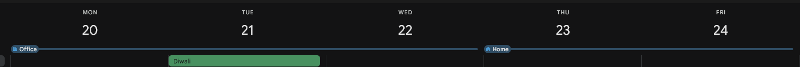
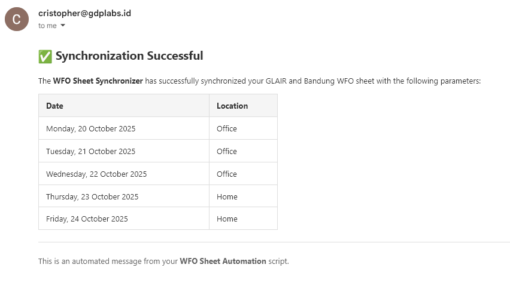
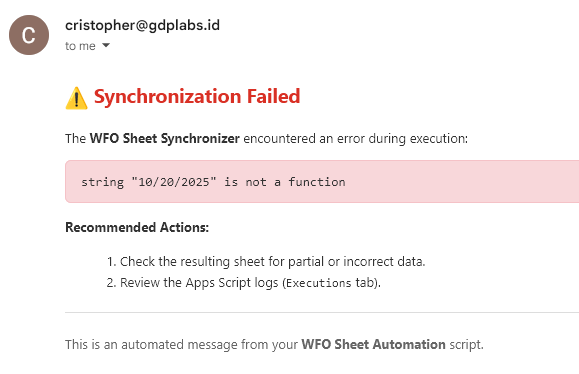
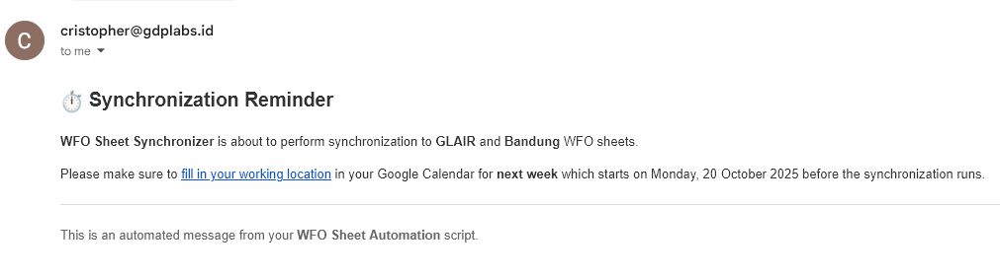

# WFO Day Synchronizer

A [Google Apps Script](https://developers.google.com/apps-script) that synchronizes your [Google Calendar's Working Location](https://support.google.com/calendar/answer/7638168?hl=en&co=GENIE.Platform%3DDesktop)
with GLAIR's WFO Sheet.

## Features

1. Synchronize your WFO days effortlessly with Google Calendar.
2. Sends you an email that denotes the status of the synchronization.
3. Bonus: Sends you a reminder email to fill your Google Calendar.
4. Bonus: Synchronizes Bandung WFO sheet.

## Prerequisites

1. A GDP Labs Google Account

## Installation

> [!NOTE]
> Before installation, please take a note on your employee ID

1. Navigate to the [Apps Script dashboard](https://script.google.com/home)
2. Create a new project
3. Paste the contents of `src/sheet.gs` to `Code.gs` in the editor.
4. Navigate to the 'Project Settings' tab
5. Add your employee ID to the script properties as `EMPLOYEE_ID`
6. Deploy the script by clicking Deploy > New Deployment
7. Select 'Library' type by clicking the cog icon. (Optional) Fill the description. Press 'Deploy'
8. Navigate to the 'Triggers' tab. Select 'Add Trigger' button on the bottom right of the interface.
9. Select `synchornizeWFOSheet` as the function to run, configure the time-based timer to Week timer and suitable time of day as you like.
10. (Optional) Create a new trigger for `sendSynchronizationReminder` with time-based timer that ideally runs before `synchronizeWFOSheet` on weekly basis.

### Bandung Synchronizer

1. Navigate to the 'Project Settings' tab
2. Add Bandung Sheet ID `1XObyMQdM9aFkbyAyg8vMDyYcz9d_WtmlZq3sMihfFQM` to the script properties as `BANDUNG_SHEET_ID`

## Notes

1. At the moment, the script can only recognize `Home` and `Office` as the location.

## Showcase

| Success Email | Failure Email | Reminder Email |
| --- | --- | --- |
|  |  |  |

## License

This project is licensed under the [Unlicense](./LICENSE)
